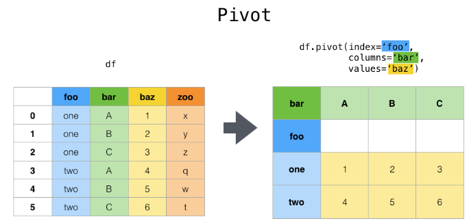
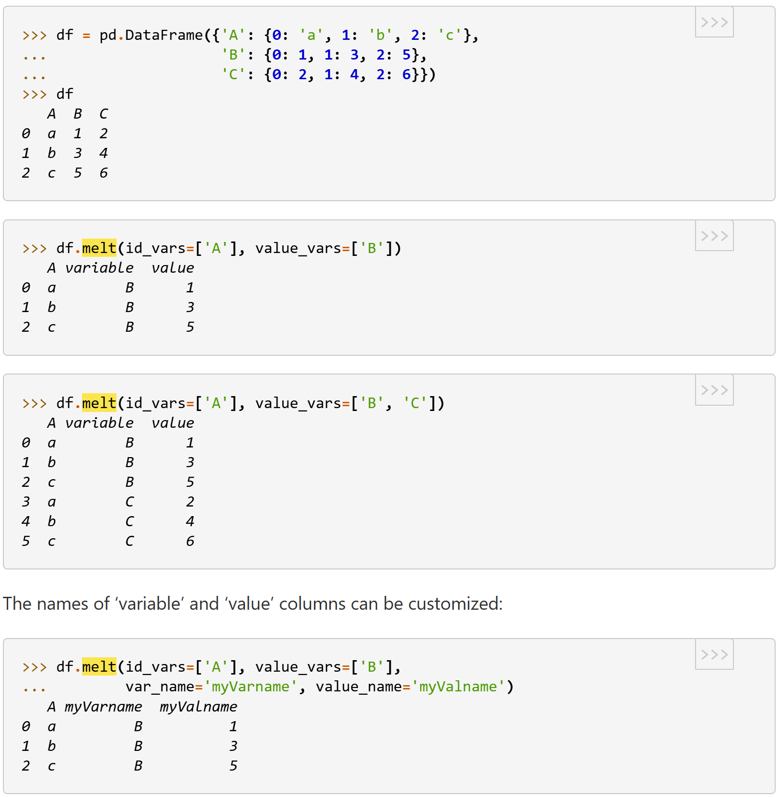
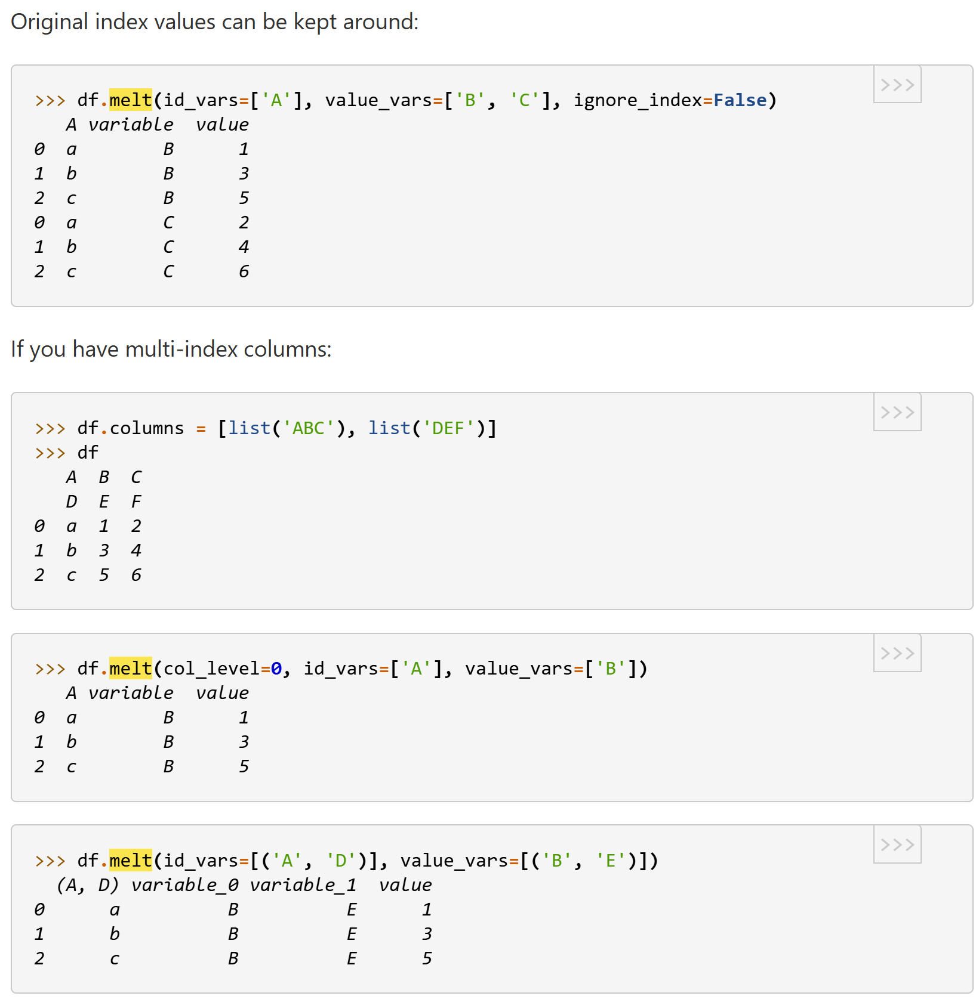
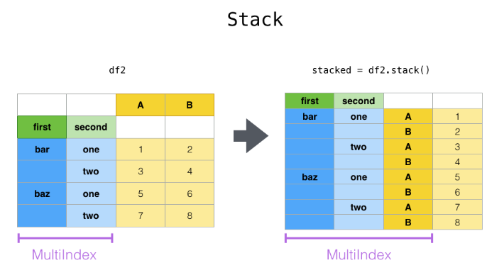
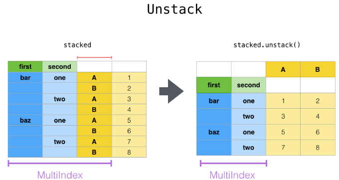
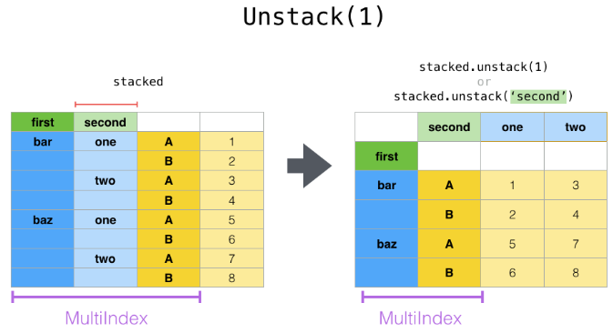
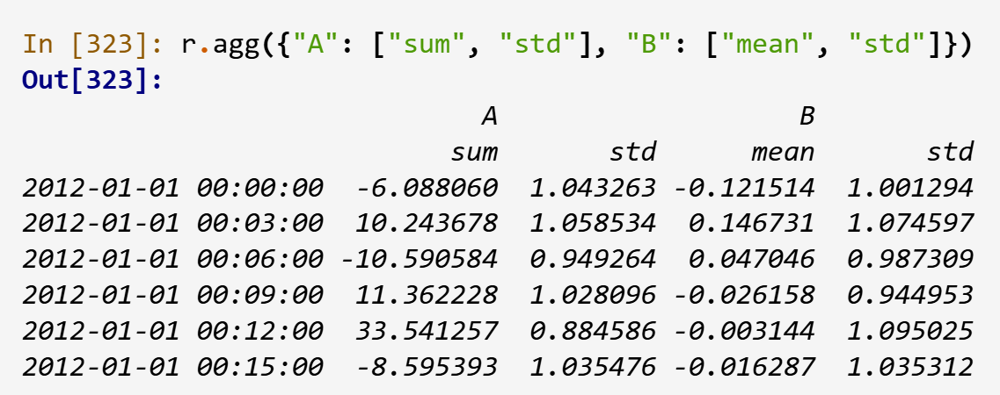

# Based on Pandas 2.3

## create Series
pd.Series([], index=[])
d = {"a": 0.0, "b": 1.0, "c": 2.0}
pd.Series(d, index=["b", "c", "d", "a"])
pd.Series(5.0, index=["a", "b", "c", "d", "e"])
### Read Series item - dict like
ds['a']
ds.get('a')
### name and rename
ds.name
ds.rename(new_name, implace=True)
### recommend to use .array/.to_numpy() rather than .values
### .array return ExtensionArray; .to_numpy() return np.array

## create DataFrame
pd.DataFrame(2d-array # shape of (r, c), columns=['a', 'b'], index=[])
pd.DataFrame({'a':1, 'b':[1,2]}, index=[0, 1]) # all 1 for col 'a'
### deletion - Columns can be deleted or popped like with a dict
del df["two"]
three = df.pop("three")
### insert new column, inplace
df.insert(1, "bar", df["one"]) # 2nd column named 'bar'
### assign new column in method chains, always return a new copied dataframe
df.assign(sepal_ratio=df["SepalWidth"] / df["SepalLength"])
df.assign(sepal_ratio=lambda x: (x["SepalWidth"] / x["SepalLength"]))
df.assign(C=lambda x: x["A"] + x["B"], D=lambda x: x["A"] + x["C"])
### check empty dataframe
df.empty
### df rename
df.rename(columns={}, index={})

## Selection or Setting
### selection by label df.loc(), df.at()
### for slicing, both ends are included
df.loc[idx[0]] # select one row
df.loc[:, 'a'] # select one col as Series
df.loc[:, ['a']] # select one or more columns as DataFrame
df.loc[0:10, ['a', 'b']] # label slicing
df.loc[0, 'a'] == df.at[0, 'a'] # return a scalar
df.at[0, 'a'] = 100

### selection by position df.iloc(), df.iat()
df.iloc[3] # select one row
df.iloc[:, 0] # return a Series
df.iloc[0:3, 2:5] # slicing
df.iloc[[1,2], [1,3]]
df.iloc[0, 1] = df.iat[0, 1]

df.iloc[:2, :3] = 1
df.iloc[:2, :3] = [1,2,3] # 2 rows of [1,2,3]
df.iloc[:2, :3] = [[1,2,3],[4,5,6]]
df.iloc[:2, :3] = [[1],[2]] # will be error

### Combining positional and label-based indexing
df.loc[df.index[[0, 2]], 'A']
df.iloc[[0, 2], df.columns.get_loc('A')]
df.iloc[[0, 2], df.columns.get_indexer(['A', 'B'])] # multiple cols

### accessing multi-level columns
### df has two level column index: level 1: ['one', 'two'], level 2: ['first', 'second']
df['one']['second'] # slow
df.loc[:,('one','second')] # recommended

## df.convert_dtypes() ds.convert_dtypes() # convert input data to proper dtypes by correctly handling pd.NA values
### very useful for reading dataset from IO. Otherwise, the datatype may be 'object'.

## Select dtypes
df.select_dtypes(include=['number', 'bool', 'object'], exclude=['unsignedinteger'])
### check all dtypes
def subdtypes(dtype):
    subs = dtype.__subclasses__()
    if not subs:
        return dtype
    return [dtype, [subdtypes(dt) for dt in subs]]
subdtypes(np.generic)

## df.to_numpy(), ds.to_numpy()
## df.describe()
## df.info()
## df.value_counts()
# ds.to_frame()

## Binary Operation df.sub/add/mul/div
row = df.iloc[1]
df.sub(row, axis=1) # axis=1 for row, axis=0 for col
col # ds of single index same as the 2nd level index of df
df.sub(col, axis=0, level=2) # for multiple index

## Compare dataframes or series
### index needs to be in the same order for equality to be True
df.equals(df1) will treat NA as equal
df==df1 will treat NA as non-equal

## Combine two dataframe, use 2nd df to fillna of first one
df.combine_first(df1)
df.update(df1) # will update non-na values as well

## method chain of 3rd party function which return dataframe
def a(df, p1) ->; def b(p1, df)->df
Old style: b(p1='ho', a(df, p1='hi'))
Recommended: df.pipe(a, p1='hi').pipe((b, "df"), 'ho')

## Row or column-wise function application
### df.apply(lambda, axis) # return Series or DataFrame
df.apply(lambda x: np.mean(x)) # return Series
df.apply(np.exp) # return DataFrame
df.apply(lambda x: x.idxmax()) # get idx of max value happened for each column
### pass additional arguments and keyword arguments
def subtract_and_divide(x, sub, divide=1):
    return (x - sub) / divide
df.apply(subtract_and_divide, args=(5,), divide=3)
### use Series method
df.apply(pd.Series.interpolate)

## Aggregation API (No Groupby) - Differet behaviour when used with GroupBy
### df.agg(func=None, axis=0, *args, **kwargs)
### func can be function or function name string or list of fun/fun_name, same as apply() if using single function
### *args, **kwargs are passed to func
### return scalar (Series.agg called with single function), Series (DF.agg called with single function) or DataFrame (DF.agg called with multiple functions)
df.agg({"A": "mean", "B": "sum"}) # return a Series with index ['A', 'B']
df.agg({'A' : ['sum', 'min'], 'B' : ['min', 'max']}) # return df with full columns and 3 rows ['sum', 'min', 'max']
df.agg(['sum', 'min']) # return df with full columns and two rows ['sum', 'min']
df.agg(x=('A', 'max'), y=('B', 'min'), z=('C', 'mean')) # return a dataframe of 3 columns ['A', 'B', 'C'] and 3 rows [x, y, z] with plenty of NA
### custom describe()
from functools import partial
q_25 = partial(pd.Series.quantile, q=0.25)
q_25.__name__ = "25%"
df.agg(["count", "mean", "std", "min", q_25, "median", q_75, "max"])

## Transform API (No Groupby) - Differet behaviour when used with GroupBy
### df.transform(func=None, axis=0, *args, **kwargs) - can used with GroupBy
### func can be function or function name string or list of fun/fun_name
### *args, **kwargs are passed to func
### return A DataFrame that must have the same length as self
### with single function
### df.transform(func) == func(df)
df.transform(lambda x: x + np.max(x), axis=1)
df.transform({"A": np.abs, "B": lambda x: x + 1})
### with multiple functions, will return a column MultiIndexed DataFrame
df.transform([np.abs, np.exp]) # cannot reduction function such as mean(), max()
df.transform({"A": np.abs, "B": [lambda x: x + 1, "sqrt"]})

## ApplyMap API - elementwise functions
### df.applymap(), ds.map()
### ds.map can be used to 'map' values defined by 2nd Series
s = pd.Series(["six", "seven", "six", "seven", "six"], index=["a", "b", "c", "d", "e"]
t = pd.Series({"six": 6, "seven": 7})
s.map(t) # return a Series with values=[6,7,6,7,6] and index=["a", "b", "c", "d", "e"]

## Reindexing and altering labels
### reindex() will check if the index is monotonically increasing
### ds.reindex(method), df.reindex(index, columns, axis, method), will filled with NA for new index and columns
ds.reindex(['a','b'])
df.reindex(index=[0, 1, 2], columns=['a', 'b'], method='ffill'/'bfill'/'nearest') # method for how to fillna
df.reindex(['a', 'b'], axis=1)

## Aligning objects with each other
### return a tuple of aligned two objects
### join could be 'outer', 'inner', 'left', 'right'
### ds.align(ds1, join), df.align(df1, join)

## Iteration
### Iter cols
for col in df
for col_name, series in df.items()
### Iter rows
for idx, ds in df.iterrows() # convert row to Series, lower compared to intertuples
for idx, np-array in df.itertuples() # much faster than iterrows

## df.drop_duplicates(subset=['a'])

## df.drop()
### columns
df.drop('a', axis=1) df.drop(columns='a') df.drop(columns=['a'])
### rows
df.drop(0) df.drop(index=0) df.drop(index=[0])

## Calculations with missing data
### When summing data, pd.NA values or empty data will be treated as zero
### When taking the product, pd.NA values or empty data will be treated as 1
### Cumulative methods like cumsum() and cumprod() ignore pd.NA values by default preserve them in the result. This behavior can be changed with 'skipna'

## df.dropna()
### columns
df.dropna(axis=1) df.dropna(how='all/any', axis=1) df.dropna(thresh=3, axis=1) # column with less than 3 valid values will be droped
### rows
df.dropna() df.dropna(subset=['a']) #subset for rows only 
df.drop(how='all/any') df.drop(thresh=3, inplace=True, ignore_index=True)

## df.fillna(
  value, # scalar/dict/Series/DataFrame, CANNOT be List
         # dict.key and Series.index matches column names of df
         # dataframe should match the shape of original df
)
df.fillna(0)
df.fillna({'a':0})
df.fillna(pd.Series([0,0], index=['a','b']))
df.fillna(pd.DataFrame([[1,2],[3,4]], columns=['a','b']))
df.fillna(df.mean())

## df.ffill(limit) df.bfill(limit)
df.ffill()
df.bfill(limit=3)

## df.interpolate(method) ds.interpolate(method) # fillna by interpolation, methods = ["linear", "quadratic", "cubic", "barycentric", "phcip", "akima"]
df.interpolate(method='spine', order=2)
df.interpolate(method='polynomial', order=2)
### Interpolating new observations from expanding data with Series.reindex()
ser = pd.Series(np.sort(np.random.uniform(size=100)))
new_index = ser.index.union(pd.Index([49.25, 49.5, 49.75, 50.25, 50.5, 50.75]))
interp_s = ser.reindex(new_index).interpolate(method="pchip")

## df.replace(), ds.replace()
### used similarly as fillna()
### replace string
df.replace(r"\s*\.\s*", np.nan, regex=True)

## df.where(cond, other) # replace with 'other' value if not meeting 'cond', opposite of df.mask()
## df.mask(cond, other) # repalce with 'other' value if meeting 'cond'
df.where(df>0, -df) # cond is the same shape of original df, replace based on each element of the condition
df.where(df['a']>0, -df) # cond is a series, replace the whole row

## sorting
df.sort_values(['a'], ascending, key, ignore_index)
df.sort_index(axis, ascending)

### Series
### Series of String
ds.str.len() # return a series of the string len for each item, slower than df.apply(lambda x: len(x))
ds.str.match(pattern)] # match regex pattern

## IO Tools
pd.read_csv(file_path, header=0, index_col=0)

## Sampling
#df.sample(n, frac, weight, random_state, axis)

## Query
df.query('(a>0) & (b>0)')
df.query('index > 0') # query based on index
df.query('color == "red"') # 'color' is one level of multi-level-index
df.query('a in b and c not in d')
df.query('a == ["1", "2", "3"]') # equivalent to df[df['a'].isin(["1", "2", "3"])]

## Concatenate
### vertically
pd.concat([df1, df2], ignore_index=True)

### based on dict of df
pieces = {"x": df1, "y": df2, "z": df3}
pd.concat(pieces) # result is multi-level index, with dict keys as level 1 index
pd.concat(pieces, keys=["z", "y"]) # only for selected keys
pd.concat([df1, s2.to_frame().T], ignore_index=True) # add row

### horizontally
pd.concat([df1, df2], axis=1)
pd.concat([df1, df2.reindex(df1.index)], axis=1)
pd.concat([df1, ds1], axis=1) # concat df with Series, add col

## Merging
### pd.merge(left_df, right_df, how='left/right/inner/outer/cross', on, left_on, right_on, left_index, right_index, validate)
### if set 'validate' True, will check on duplicate keys before merging

## Reshaping
### pivot
### df.pivot(index, columns, values) # all parameters can be single value or a list

df.pivot(index=["A","B"], columns="D", values="C") # multilevel index
df.pivot(index="C", columns=["A","B"], values="D") # multilevel column
df.pivot(index="C", columns="D", values=["A","B"]) # multilevel column

### pd.pivot_table
pd.pivot_table(df, values="D", index=["B"], columns=["A", "C"], aggfunc=np.sum)
pd.pivot_table(df, values="D", index=pd.Grouper(freq="M", key="F"), columns="C") # can use *Grouper* for index and columns

### melt

## stack
### column name become a column

df.stack() # need to set index properly first

## unstack
### column become column names

df.unstack() # need to set index properly first

## Tilting
### pd.cut()
c = pd.cut(ages, bins=3) # c is Categories type
pd.cut([25, 20, 50], bins=c.categories) # Categories type can be used to set bins

## Exploding
df['values'].explode() # return a Series
df.explode('values') # return a DataFrame

## GroupBy - Split-Apply-Combine
for i, g in df.groupby(['a','b'])
### Grouping DataFrame with Index levels and columns
df.groupby([pd.Grouper(level=1), "A"])
### Groupby column selection
df['c'].groupby(df['A']) equivalent to df.groupby['A']['c']
### Get a group
grouped.get_group("bar")
### Group without index for agg
df.groupby(["A", "B"], as_index=False).sum()
df.groupby(["A", "B"]).sum().reset_index()
### Named agg - pd.NamedAgg or simple tuple
animals.groupby("kind").agg(
    min_height=pd.NamedAgg(column="height", aggfunc="min"),
    max_height=pd.NamedAgg(column="height", aggfunc="max"),
    average_weight=pd.NamedAgg(column="weight", aggfunc=np.mean),
)
animals.groupby("kind").agg(
    min_height=("height", "min"),
    max_height=("height", "max"),
    average_weight=("weight", np.mean),
)
### Groupby Transform
animals.groupby("kind").transform(
    lambda x: x.median()
)
animals.groupby("kind")['height'].transform(
    lambda x: x-x.median()
)

### Filtration
dff.groupby("B").filter(lambda x: len(x) > 2) # only keep filtered group
dff.groupby("B").filter(lambda x: len(x) > 2, dropna=False) # filtered group will be filled with NA
### Flexible apply
apply can act as a reducer, transformer, or filter function, depending on exactly what is passed to it
### applied series to dataframe
def f(group):
    return pd.DataFrame({'original': group,
                         'demeaned': group - group.mean()})
grouped = df.groupby('A', group_keys=True)['C'] # group_keys=True will include group keys as index for *apply()* function, works for single column only
grouped.apply(f)
def f(x):
    return pd.Series([x, x ** 2], index=["x", "x^2"])
s = pd.Series(np.random.rand(5))
ds.apply(f) # return will be a dataframe with 2 columns 'x' and 'x^2'

## Window Operation
### Window function always followed by Agg function
### If a time based offset is provided, the corresponding time based index must be monotonic
### rolling(window, min_periods, center, closed='left','right','both','neither'). 'closed' is for including window edge
ds.rolling(window=2, min_periods=1, center=True).sum()
ds.rolling(window='2D').sum() # for datetime index
s.rolling(window=4).apply(func, raw=True) # raw=True, so data will convert to np array and pass to func 
df.rolling(window=2).sum()
### Expanding window
### An expanding window yields the value of an aggregation statistic with all the data available up to that point in time.
### df.rolling(window=len(df), min_periods=1) equivalent to df.expanding(min_periods=1)

## Date Time Functionality
pd.to_datetime()
pd.to_datetime("2010/11/12", format="%Y/%m/%d")
pd.to_datetime(1745078400, unit='s')
pd.to_datetime().timestamp() # use timestamp() to convert to unix timestamp in second
pd.date_range(start, end, periods, freq)
friday = pd.Timestamp("2018-01-05")
saturday = friday + pd.Timedelta("1 day")
### accessing datetime method
df.index.hour
ds.dt.hour
df.dt.tz_localize().tz_convert()
### resample(freq, closed='left'/'right', label='left'/'right') # label specifies whether the result is labeled with the beginning or the end of the interval.
ts.resample("2H").mean()
### other time series function
ts.shift()
ts.asfreq()
### a Resampler can be selectively resampled.
df.resample("3T")['A'].mean()
df.resample("3T")['A'].agg([np.sum, np.mean, np.std])
### Different behavior of agg()
df.resample("3T").agg({"A": ["sum", "std"], "B": ["mean", "std"]}) # return dataframe of multi-level column, ['A','B'] is level 1

