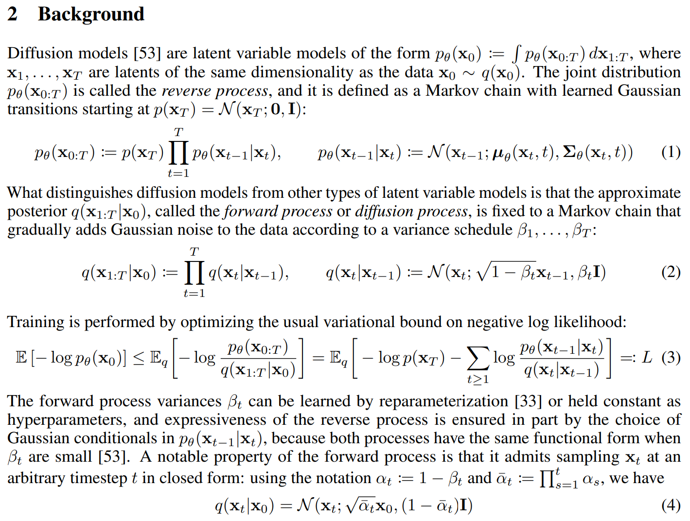
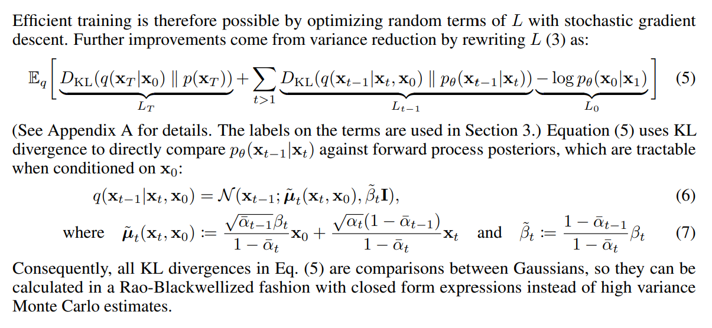
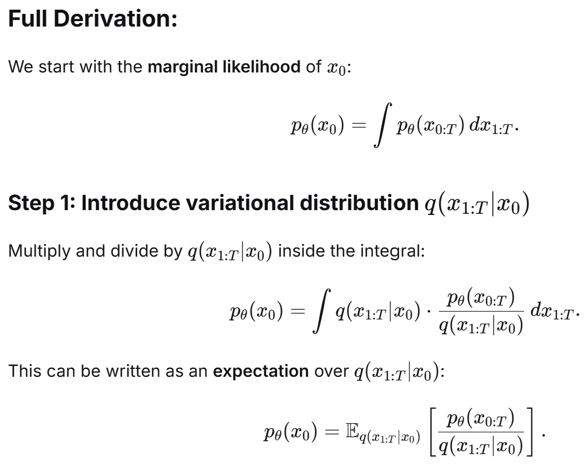
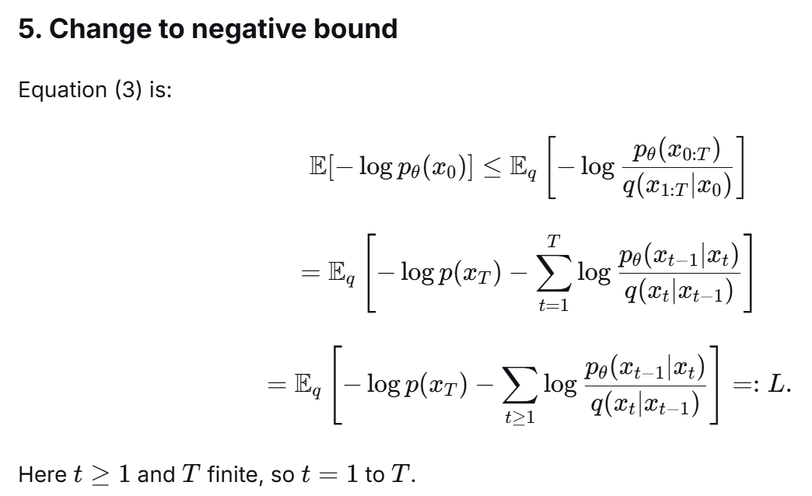
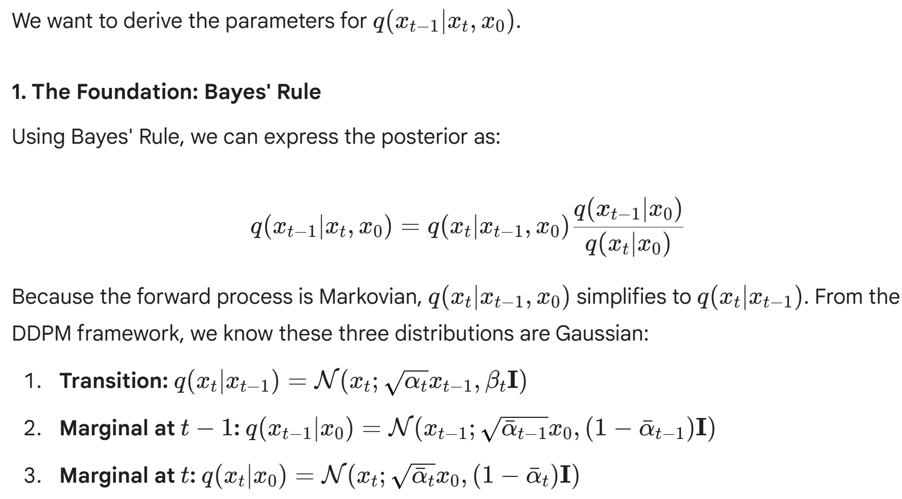
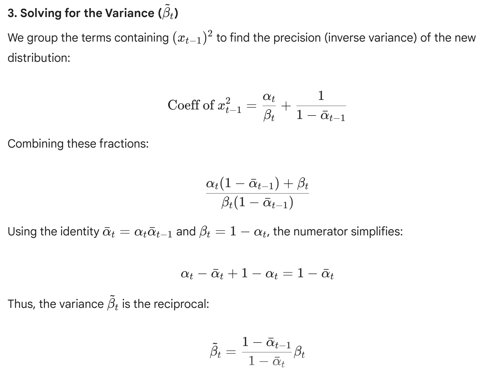
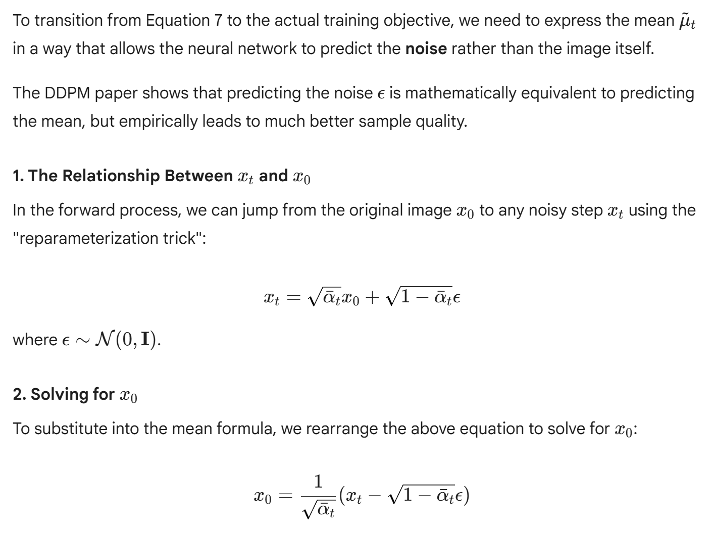

# Study Stable Diffusion

### Background Formular

### Proof of Equation (3)

### Proof of Equation (5)
- Note, by condition on X0, equation 5 is tractable!
- In Eq. (26) the problematic terms are KLs of the form D_KL(q(x_{t-1}|x_t) || p_theta(x_{t-1}|x_t)).
- q(x_{t-1}|x_t) is the marginal posterior under the forward noising process: q(x_{t-1}|x_t) = ∫ q(x_{t-1}|x_t,x0) q(x0|x_t) dx0.
- That integral requires the posterior q(x0|x_t) (or equivalently marginalizing over the unknown data x0) and cannot be computed in closed form in general, so you cannot evaluate the density q(x_{t-1}|x_t) or the KL.
- By contrast, conditioning on x0 gives q(x_{t-1}|x_t,x0), which for the usual Gaussian forward diffusion is available analytically (a Gaussian), so the KLs become tractable and computable.
- Therefore the unconditioned form is said to be intractable because it requires intractable marginalization over x0 (and the data posterior q(x0|x_t)).

### Proof of Equation (7)

-Note: we need to find \miu and \sigma of x_t-1 which is (x-miu)^2/sigma^2 = x^2/sigma^2-2*miu*x/sigma
as shown in below step, we find sigma first, then followed by miu

### Reparameterization Trick

reparameterization trick fomular will be used to substitute x0 in equation (7) of the paper to get u(xt, x0) as in equation (10)

### transition from Equation 7 to the actual training objective equation (12)

### The Sampling Loop (Algorithm 2)

