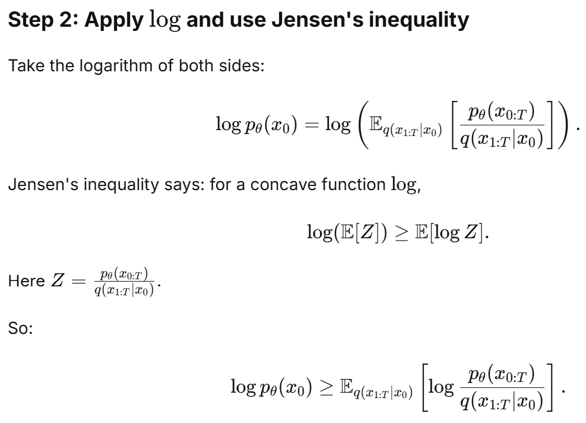
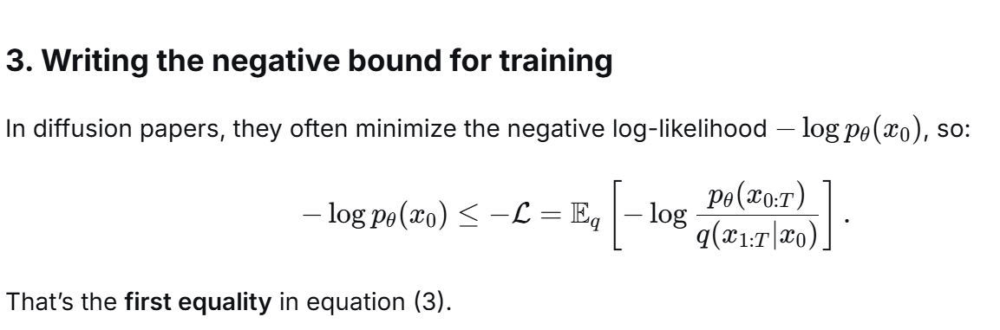
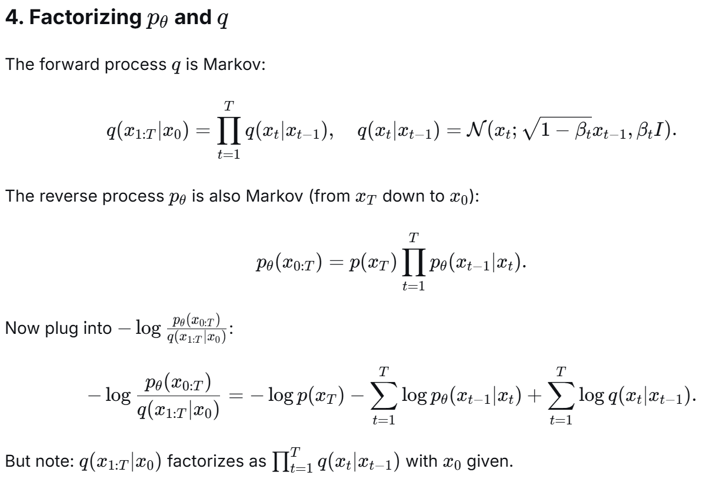
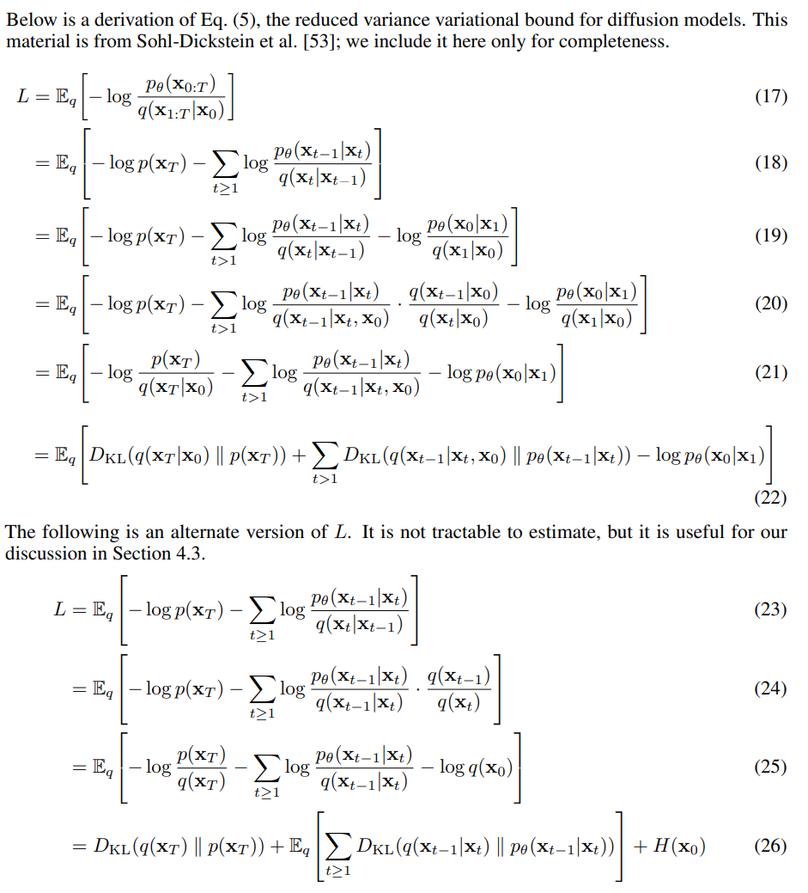
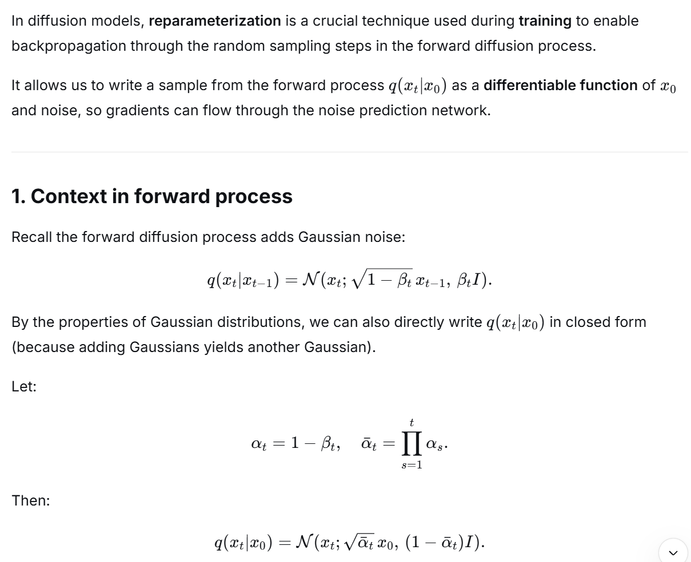
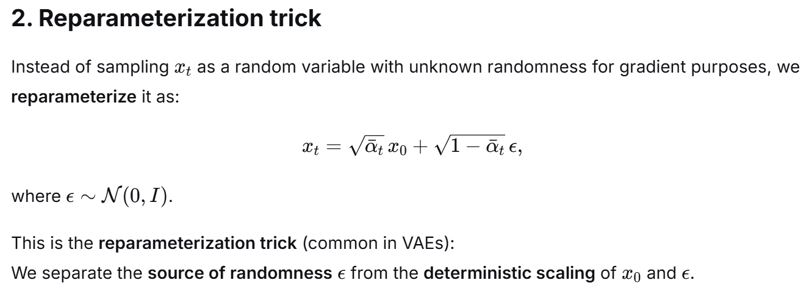
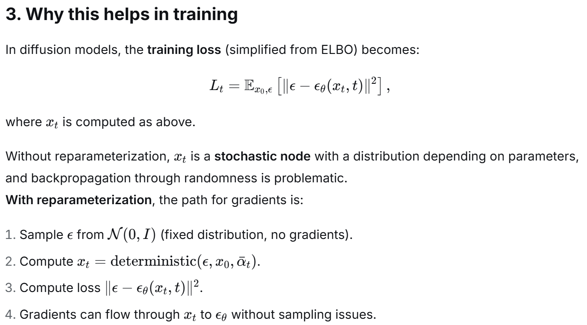

# Study Stable Diffusion

### Background Formular

### Proof of Equation (3)

### Proof of Equation (5)
- Note, by condition on X0, equation 5 is tractable!

### Reparameterization Trick

reparameterization trick fomular will be used to substitute x0 in equation (7) of the paper to get u(xt, x0) as in equation (10)

