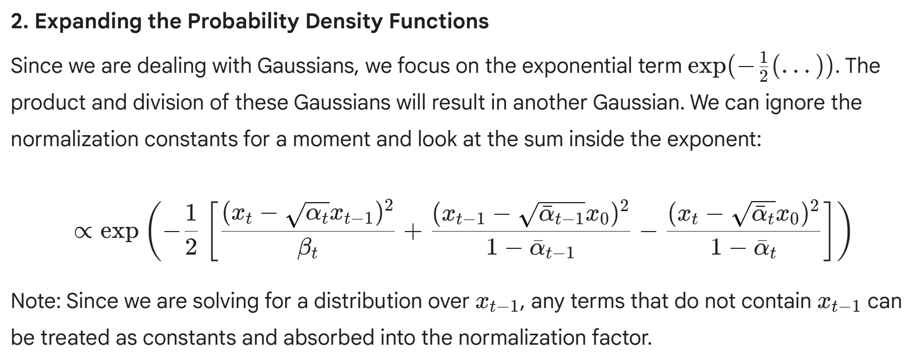
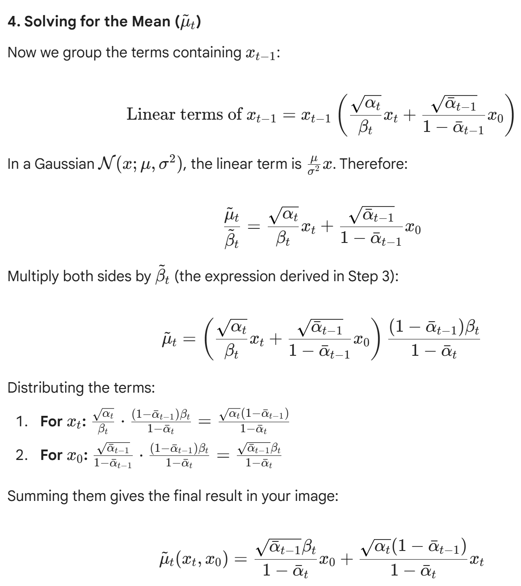
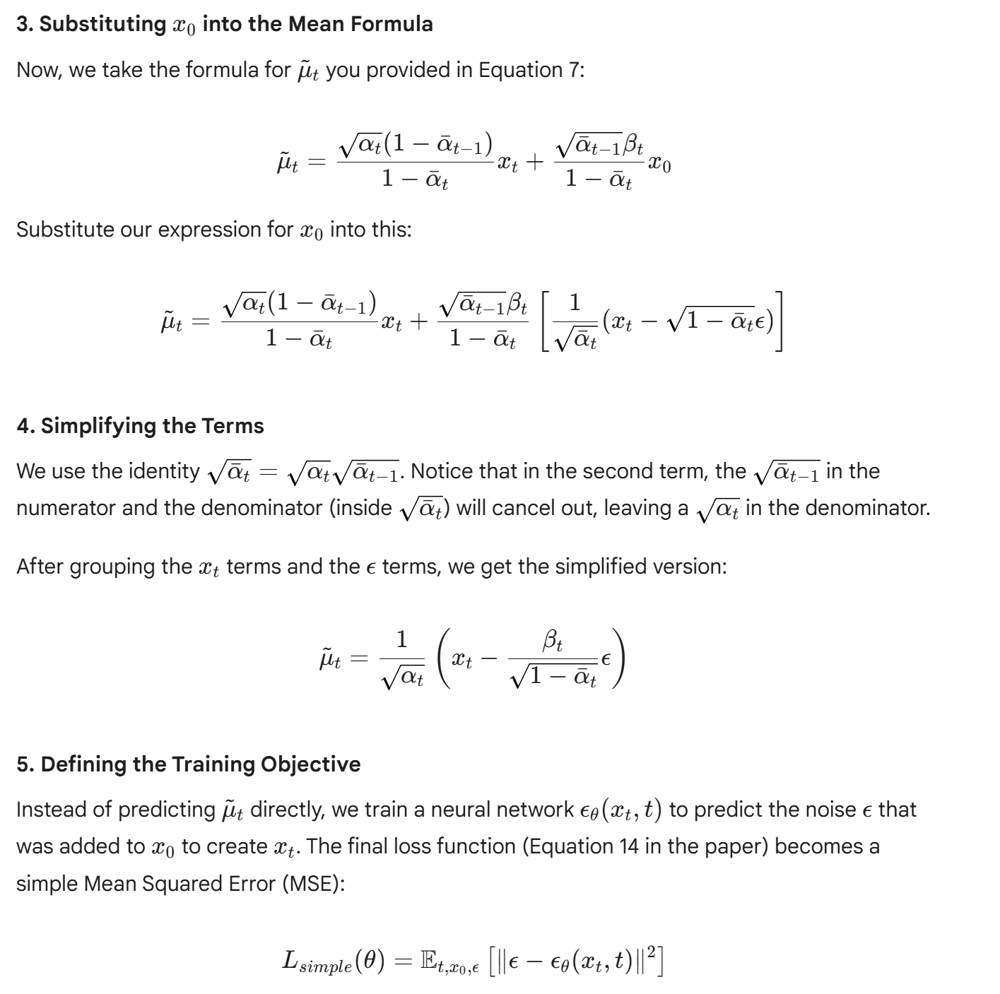
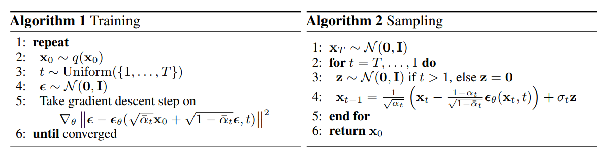
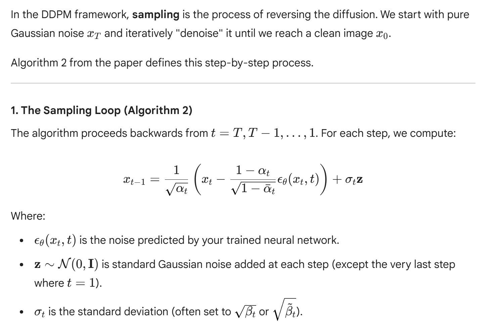
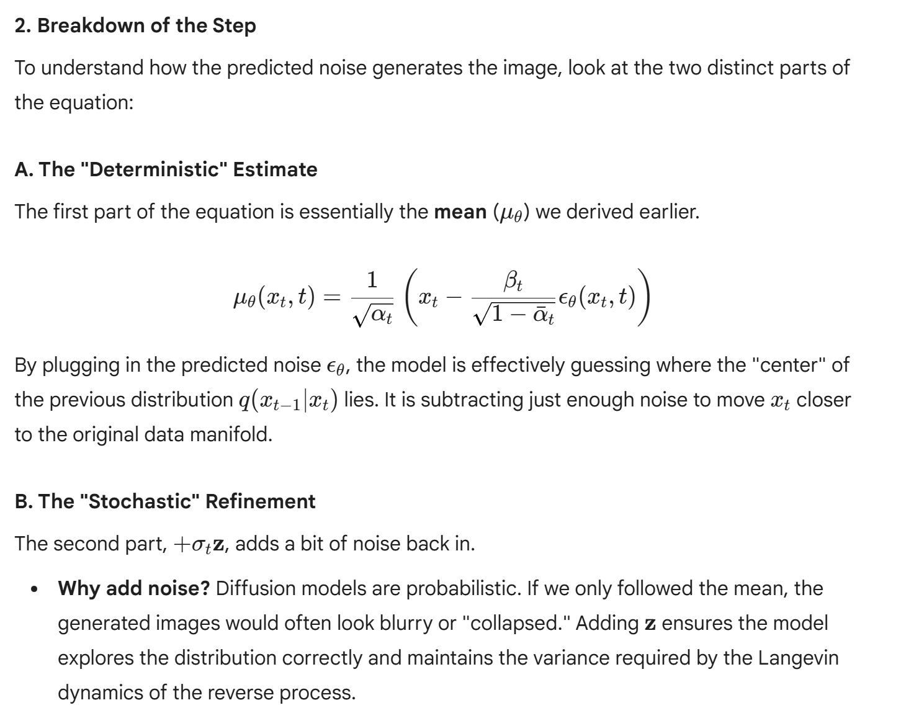
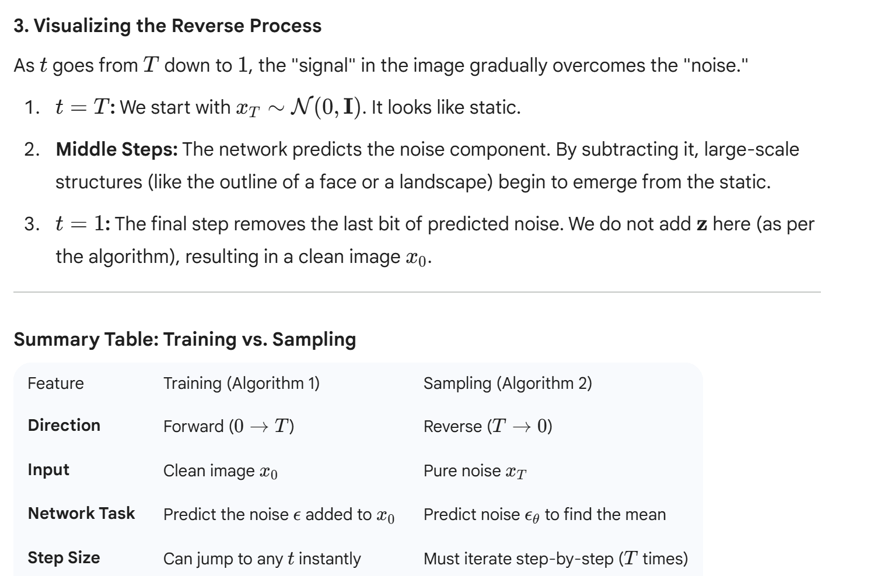

# Study Stable Diffusion

### Background Formular

### Proof of Equation (3)

### Proof of Equation (5)
- Note, by condition on X0, equation 5 is tractable!

### Proof of Equation (7)

-Note: we need to find \miu and \sigma of x_t-1 which is (x-miu)^2/sigma^2 = x^2/sigma^2-2*miu*x/sigma
as shown in below step, we find sigma first, then followed by miu

### Reparameterization Trick

reparameterization trick fomular will be used to substitute x0 in equation (7) of the paper to get u(xt, x0) as in equation (10)

### transition from Equation 7 to the actual training objective equation (12)

### The Sampling Loop (Algorithm 2)

